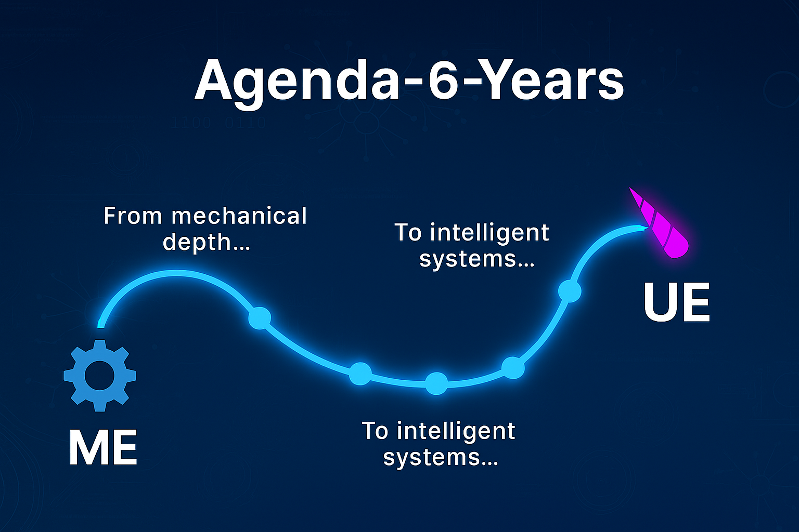

# 🦄 Agenda-6-Years

This is my master roadmap — a 6-year transformation from Mechanical Engineer to Futuristic Unicorn Engineer, blending intelligent software with mechanical depth.

## 📍 Current Status

- **Phase:** Year 1, Month 1
- **Focus:** Python fundamentals + first AI portfolio project
- **Active Repo:** [`ai-data-analyzer`](https://github.com/bamoah30/ai-data-analyzer)

## 🎯 Vision

> Build intelligent systems that think, move, and adapt — one commit at a time.

## 🗺️ Roadmap Overview

| Year | Focus Area                         | Outcome Goal                          |
| ---- | ---------------------------------- | ------------------------------------- |
| 1    | AI Engineering Fundamentals        | ML Engineer (Anthropic/Google/Tesla)  |
| 2    | Advanced ML + Robotics Integration | Research Engineer / Robotics Engineer |
| 3    | Full-stack Intelligent Systems     | Lead AI Developer                     |
| 4    | Hardware + Software Fusion         | Autonomous Systems Architect          |
| 5    | Scalable Impact Projects           | Founder / CTO                         |
| 6    | Legacy + Open Source Contributions | Global Tech Contributor               |

## 🧠 Learning Streams

- **AI Engineering**: Python, ML, DL, LLMs, MLOps
- **Robotics (Parallel Track)**: ROS, CV, control systems
- **Math Foundations**: Linear Algebra, Calculus, Optimization
- **Portfolio Building**: GitHub, Streamlit, FastAPI, React
- **Public Learning**: LinkedIn, Dev.to, Medium

## 🔗 Key Repos

- 🚀 [`ai-data-analyzer`](https://github.com/bamoah30/ai-data-analyzer) — Week 4 milestone
- 🧠 `sql-query-dashboard` — coming soon
- 📊 `ml-web-app-v1` — Month 3 deployment
- 🏭 `intellimaint` (Capstone) — Month 12 launch
- 🗃️ `Public Archive` — legacy repos, tagged and frozen

## 🧪 Build in Public

This repo evolves weekly. I document everything — wins, pivots, frustrations, breakthroughs on LinkedIn.  
Follow the journey. Fork the roadmap. Build your own.
